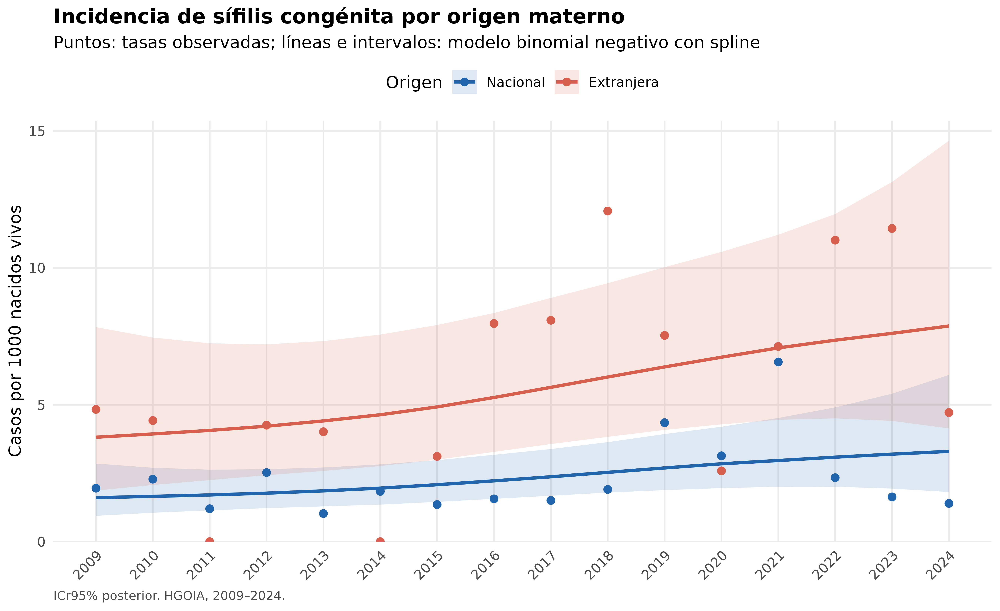
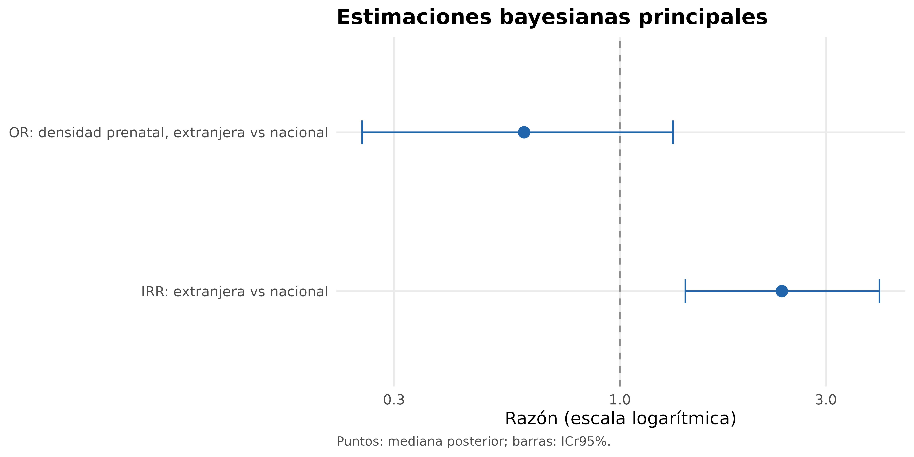
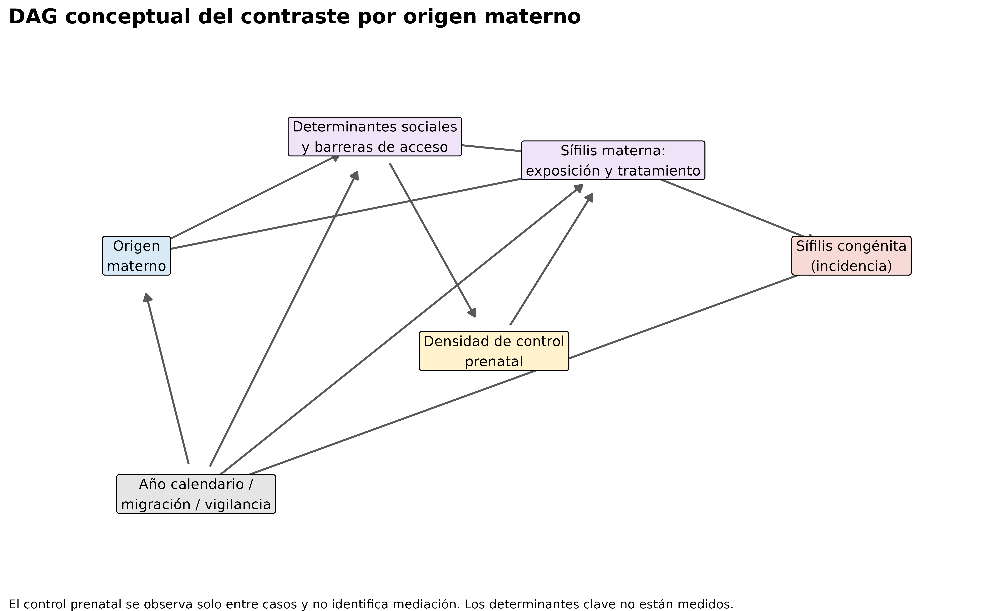

```{r setup, include=FALSE}
knitr::opts_chunk$set(echo=FALSE,warning=FALSE,message=FALSE,dpi=300)
library(readr); library(dplyr); library(flextable); library(knitr)
t1<-read_csv("output/articulo/tabla1_caracteristicas_por_origen.csv",show_col_types=FALSE)
t2<-read_csv("output/articulo/tabla2_tasas_anio_origen.csv",show_col_types=FALSE)
tm<-read_csv("output/articulo/tabla_modelo_principal.csv",show_col_types=FALSE)
t4<-read_csv("output/articulo/tabla4_control_prenatal_por_origen.csv",show_col_types=FALSE)
t4b<-read_csv("output/articulo/tabla4b_modelo_control_prenatal.csv",show_col_types=FALSE)
mcmc<-read_csv("output/articulo/tabla_diagnosticos_mcmc.csv",show_col_types=FALSE)
freq<-read_csv("output/articulo/tabla_diagnosticos_frecuentistas.csv",show_col_types=FALSE)
den<-read_csv("output/articulo/tabla_verificacion_denominadores.csv",show_col_types=FALSE)
s21<-read_csv("output/articulo/tabla_sensibilidad_2021.csv",show_col_types=FALSE)
s24<-read_csv("output/articulo/tabla_sensibilidad_2024.csv",show_col_types=FALSE)
spr<-read_csv("output/articulo/tabla_sensibilidad_priors.csv",show_col_types=FALSE)
ppc<-read_csv("output/articulo/tabla_ppc_summary.csv",show_col_types=FALSE)
tloo<-read_csv("output/articulo/tabla_loo_diagnosticos.csv",show_col_types=FALSE)
rloo<-read_csv("output/articulo/resumen_loo.csv",show_col_types=FALSE)
periodos<-read_csv("output/articulo/tabla_tasas_periodos.csv",show_col_types=FALSE)
val<-function(tab,key) tab$valor[match(key,tab[[1]])]
fmt<-function(x,d=2) formatC(x,format="f",digits=d,big.mark=".",decimal.mark=",")
ft<-function(x,caption,note=NULL){z<-flextable(x)|>theme_booktabs()|>autofit()|>set_caption(caption); if(!is.null(note)) z<-add_footer_lines(z,note); z}
irr<-tm[tm$parametro=="IRR origen extranjera vs nacional",]
sh<-tm[tm$parametro=="Shape binomial negativa",]
lrt<-freq[freq$comparacion=="Lineal vs spline",]
```

# Resumen

**Introducción:** Se describió la tendencia temporal de la sífilis congénita y
su asociación con el origen materno en un hospital ecuatoriano. **Métodos:**
Estudio retrospectivo de 255 casos y `r format(sum(den$total_nacimientos),big.mark=".",decimal.mark=",")`
nacidos vivos entre 2009 y 2024. Se ajustó un modelo bayesiano binomial negativo
con spline temporal de placa delgada y offset de nacimientos a 32 estratos año ×
origen. **Resultados:** El origen materno extranjero se asoció con mayor
incidencia hospitalaria registrada (IRR `r fmt(irr$estimador)`; ICr95%
`r fmt(irr$ICr95_inf)`–`r fmt(irr$ICr95_sup)`;
P[IRR>1]=`r fmt(irr$probabilidad_posterior,4)`). No hubo divergencias y las
sensibilidades (exclusión de 2021, exclusión de 2024 y priors alternativos)
mantuvieron la dirección y la interpretación. Entre 250 casos con datos
completos, la OR de densidad de control prenatal (clasificación operacional,
no una medida universal de adecuación) para origen extranjero fue
`r fmt(t4b$OR_mediana)` (ICr95% `r fmt(t4b$OR_IC95_inf)`–`r fmt(t4b$OR_IC95_sup)`).
**Conclusión:** El origen extranjero se asoció con mayor incidencia hospitalaria
registrada, con resultados robustos a la exclusión de 2021, a la exclusión de
2024 y a priors razonables. El análisis entre casos no permite evaluar
mediación por control prenatal.

**Palabras clave:** sífilis congénita; epidemiología; análisis bayesiano; origen
materno; migración; Ecuador.

# Introducción

La sífilis congénita es un desenlace perinatal prevenible cuya frecuencia refleja
la interacción entre infección materna, diagnóstico, tratamiento oportuno y
acceso efectivo a servicios. La interpretación de series institucionales exige
considerar simultáneamente cambios temporales, denominadores de nacimientos y
heterogeneidad entre grupos atendidos.

En contextos de movilidad humana, el origen materno puede resumir diferencias
sociales, administrativas y asistenciales, pero no constituye por sí mismo un
mecanismo causal. Además, las covariables individuales disponibles solo entre
casos no permiten explicar diferencias de incidencia en la población fuente.
Este estudio describió la incidencia hospitalaria registrada entre 2009 y 2024,
estimó su asociación con el origen materno y describió secundariamente el control
prenatal entre los casos.

# Métodos

## Diseño, datos y variables

Se realizaron dos análisis con unidades distintas. El análisis principal utilizó
datos agregados en 32 estratos (16 años × dos categorías de origen materno); el
desenlace fue el número de casos de sífilis congénita y el denominador fueron los
nacidos vivos institucionales, incorporados como offset logarítmico. El análisis
secundario utilizó datos individuales y se restringió a los casos de sífilis
congénita con el único fin de evaluar la asociación entre origen materno y
densidad de control prenatal; no permite evaluar mediación poblacional.

El estudio retrospectivo incluyó 255 casos registrados en el HGOIA entre 2009 y 2024.
Los denominadores institucionales fueron `r format(sum(den$total_nacimientos),big.mark=".",decimal.mark=",")`
nacidos vivos. La fuente los clasifica según país de origen materno: los
nacimientos extranjeros procedieron de la fila institucional “Total extrangeras”
y los nacionales se definieron como el total institucional menos los extranjeros;
la suma fue exacta en los 16 años. Se construyeron 32 estratos año × origen, con
219 casos nacionales y 36 extranjeros. El origen materno estuvo registrado en
255/255 casos (100%); la completitud fue 100% en cada año calendario, sin
variación anual ni años por debajo de 90%.

Se calcularon tasas como casos/nacidos vivos × 1.000. La densidad de control
prenatal se definió como el número de consultas prenatales dividido por las
semanas de gestación. Se clasificó operacionalmente como densa cuando fue ≥0,20
consultas/semana y como no densa cuando fue <0,20; este punto de corte es una
clasificación operacional del presente análisis, no una medida universalmente
validada de adecuación prenatal. El análisis se restringió a casos con ambas
variables disponibles.

## Diagnóstico exploratorio

Se compararon modelos Poisson con origen, año lineal, interacción origen × año y
spline natural de tres grados de libertad, además de una binomial negativa
exploratoria. Se obtuvieron log-verosimilitud, AIC y BIC, y los modelos Poisson
anidados se compararon mediante LRT. La dispersión de Pearson se calculó como la
suma de residuos de Pearson al cuadrado dividida por los grados de libertad
residuales. La influencia se evaluó mediante distancia de Cook, con umbral 4/32
=0,125.

## Modelo bayesiano principal

Se ajustó
$$Y_i\sim\operatorname{NB}(\mu_i,\phi),\qquad
\log(\mu_i)=\log(N_i)+\beta_0+\beta_1O_i+f(A_i),$$
donde $f$ fue un spline de placa delgada (`bs="tp"`, dimensión de base $k=4$),
$N_i$ los nacimientos y $O_i$ el origen extranjero. Los priors fueron
Normal(−6;1,5) para el intercepto, Normal(0;1) para origen, Gamma(2;2) para la
desviación estándar del spline y Exponencial(1) para `shape`.

El modelo no incluyó un indicador `post_2020`, changepoint ni interacción
origen × tiempo; la especificación final empleó únicamente una función temporal
suave común y un contraste constante de origen.

Se usaron cuatro cadenas, 4.000 iteraciones por cadena, 2.000 de calentamiento,
semilla 20260810, `adapt_delta=0,999` y `max_treedepth=15`. Se evaluaron Rhat,
ESS, divergencias, treedepth y E-BFMI por cadena. La bondad de ajuste se evaluó
mediante comprobaciones predictivas posteriores generadas con
`posterior_predict()`, contrastando la varianza global y el conteo del estrato
influyente 2021-nacional con sus distribuciones predictivas. Se calcularon
P[varianza replicada ≥ observada] y P[conteo replicado ≥ observado]. La
validación cruzada dejando uno fuera (LOO) evaluó la estabilidad predictiva por
estrato; valores de Pareto-k ≥0,7 se consideraron potencialmente problemáticos.
El modelo principal no incluyó covariables maternas individuales (p. ej. edad,
gestas previas, control prenatal) como ajuste, porque estas solo están
disponibles entre los casos y no existen equivalentes poblacionales en el
denominador; la IRR de origen debe interpretarse como una asociación agregada
no ajustada por confusores maternos individuales. Los análisis se realizaron
en R 4.5.0 con brms 2.23.0 (backend rstan 2.32.7), posterior 1.7.0 y loo 2.8.0.

## Sensibilidades y análisis secundario

Se repitió el modelo excluyendo ambos estratos de 2021. Los nacimientos
institucionales de 2024 (2.358) fueron marcadamente menores que en todos los
años previos desde 2018 (mínimo 3.657), sin que los archivos disponibles
permitan confirmar si 2024 correspondió a un año completo o parcial de
registro; por ello se repitió también el modelo excluyendo ambos estratos de
2024. La sensibilidad de priors varió separadamente la desviación estándar del
prior de origen (0,5 y 1,5) y la tasa del prior exponencial de `shape` (0,5 y
2). El análisis logístico de control
prenatal evaluó exclusivamente la asociación entre los casos. Usó familia
Bernoulli con enlace logit y priors Normal(0;1,5) para el intercepto y Normal(0;1)
para origen. Su denominador fueron los casos con edad gestacional, consultas y
origen disponibles; no evaluó mediación poblacional. No se realizó sensibilidad
por completitud del origen porque esta fue 100% en todos los años.

# Resultados

## Características de los casos y tasas

La edad materna mediana fue 26 años (RIC 21–32); 36/255 casos (14,1%) tuvieron
madre extranjera. El origen materno estuvo documentado en 255/255 casos (100%) y
en el 100% de los casos de cada año calendario (rango anual 100%–100%); no se
identificó documentación diferencial por año. La Tabla 1 presenta variables
clínicas seleccionadas con sus denominadores disponibles.

```{r tabla1}
casos_tab1<-read_csv("SIFILIS_hgoia2009-2024.csv",show_col_types=FALSE,name_repair="unique_quiet")
n_cons<-sum(!is.na(casos_tab1$Número.Consultas.prenatales))
n_eg<-sum(!is.na(casos_tab1$Edad.gestaciol.RN))
n_hta<-sum(!is.na(casos_tab1$TRASTORNOS.HIPERTENSIVOS.CATEGORIA))
t1_show<-t1|>mutate(Caracteristica=case_when(
  Caracteristica=="Consultas prenatales, mediana [RIC]"~paste0(Caracteristica," (n=",n_cons,")"),
  Caracteristica=="Densidad de controles/semana, mediana [RIC]"~paste0(Caracteristica," (n=250)"),
  Caracteristica=="Control prenatal subóptimo por densidad, n (%)"~"Control prenatal no denso, n/N (%) (clasificación operacional)",
  Caracteristica=="Edad gestacional, mediana [RIC]"~paste0(Caracteristica," (n=",n_eg,")"),
  Caracteristica=="Prematuro, n (%)"~"Prematuro, n/N (%)",
  Caracteristica=="Trastorno hipertensivo, n (%)"~paste0("Trastorno hipertensivo, n/N (%) (N=",n_hta,")"),
  TRUE~Caracteristica))
poner_denominador<-function(x,N) sub("^([0-9]+) ",paste0("\\1/",N," "),x)
i_dens<-t1_show$Caracteristica=="Control prenatal no denso, n/N (%) (clasificación operacional)"
t1_show[i_dens,c("Total","Nacional","Extranjera")]<-Map(poner_denominador,t1_show[i_dens,c("Total","Nacional","Extranjera")],c(250,214,36))
i_pre<-t1_show$Caracteristica=="Prematuro, n/N (%)"
t1_show[i_pre,c("Total","Nacional","Extranjera")]<-Map(poner_denominador,t1_show[i_pre,c("Total","Nacional","Extranjera")],c(254,218,36))
i_hta<-grepl("^Trastorno hipertensivo",t1_show$Caracteristica)
t1_show[i_hta,c("Total","Nacional","Extranjera")]<-Map(poner_denominador,t1_show[i_hta,c("Total","Nacional","Extranjera")],c(253,217,36))
ft(t1_show,"Tabla 1. Características de los casos por origen materno","RIC: rango intercuartílico; EG: edad gestacional. Los porcentajes excluyen valores faltantes; la densidad ≥0,20 consultas/semana es una clasificación operacional.")
```

Las tasas observadas por los 32 estratos se muestran en la Tabla 2.

```{r tabla2}
t2_show<-t2|>mutate(tasa_1000=round(tasa_1000,2),log_nacimientos=round(log_nacimientos,3))|>select(anio,origen,casos,nacimientos,tasa_1000)
ft(t2_show,"Tabla 2. Casos, nacimientos y tasas por año y origen","Tasa por 1.000 nacidos vivos institucionales.")
```

## Diagnósticos exploratorios

El spline mejoró el ajuste frente al año lineal (LRT χ²=`r fmt(lrt$LRT_chisq,3)`,
`r lrt$LRT_df` gl; p=`r format(lrt$p_value,digits=4)`; AIC `r fmt(lrt$AIC,1)`
frente a `r fmt(freq$AIC[freq$comparacion=="Solo origen vs año lineal"],1)`).
La dispersión de Pearson del Poisson con interacción fue
`r fmt(freq$dispersion_pearson[freq$comparacion=="Lineal vs interacción"],2)`.
Cinco estratos superaron el umbral de Cook: 2021-nacional (0,810),
2010-nacional (0,190), 2023-nacional (0,148), 2020-extranjera (0,136) y
2013-nacional (0,134).

## Modelo principal y comprobación predictiva

La IRR extranjera frente a nacional fue `r fmt(irr$estimador)` (ICr95%
`r fmt(irr$ICr95_inf)`–`r fmt(irr$ICr95_sup)`), con P(IRR>1)=
`r fmt(irr$probabilidad_posterior,4)`. La mediana de `shape` fue
`r fmt(sh$estimador)` (ICr95% `r fmt(sh$ICr95_inf)`–`r fmt(sh$ICr95_sup)`).

```{r tabla3}
ft(tm|>mutate(across(where(is.numeric),~round(.x,4))),"Tabla 3. Modelo bayesiano principal","IRR: razón de tasas; ICr95%: intervalo de credibilidad del 95%.")
```

Rhat máximo=`r fmt(val(mcmc,"Rhat máximo"),4)`, ESS bulk mínimo=
`r round(val(mcmc,"ESS bulk mínimo"))`, ESS tail mínimo=
`r round(val(mcmc,"ESS tail mínimo"))`, E-BFMI mínimo=
`r fmt(val(mcmc,"E-BFMI mínimo"),3)` y cero divergencias. La probabilidad de
una varianza replicada al menos tan grande como la observada fue
`r fmt(val(ppc,"P(var yrep >= var yobs)"),3)`. Para 2021-nacional, el conteo
observado fue `r val(ppc,"2021 nacional observado")`, la mediana predictiva
`r val(ppc,"2021 mediana predictiva")` (intervalo predictivo posterior del 95%,
IP95%, `r val(ppc,"2021 IP95 inf")`–`r val(ppc,"2021 IP95 sup")`) y
P(Yrep≥observado)=`r fmt(val(ppc,"P(yrep >= observado)"),3)`. El valor observado
se situó en la cola superior de la distribución predictiva (percentil
`r fmt(100*val(ppc,"Percentil observado"),1)`), pero permaneció dentro del
intervalo predictivo, compatible con buen ajuste global y un pico temporal poco
frecuente bajo una tendencia suave. Este resultado describe la coherencia
interna del modelo con los datos observados y no debe interpretarse como
evidencia de generalización externa.

LOO produjo ELPD=`r fmt(rloo$ELPD_LOO)` (SE `r fmt(rloo$SE)`) y Pareto-k máximo
`r fmt(rloo$pareto_k_max,3)` en `r rloo$estrato_max`; ningún estrato alcanzó 0,7.

## Análisis secundario: densidad de control prenatal entre casos

Hubo 250 casos evaluables: 214 nacionales y 36 extranjeros. Según la
clasificación operacional, el control fue no denso en 150/214 nacionales (70,1%)
y 29/36 extranjeros (80,6%). La OR de control denso para origen extranjero fue
`r fmt(t4b$OR_mediana)` (ICr95% `r fmt(t4b$OR_IC95_inf)`–`r fmt(t4b$OR_IC95_sup)`),
P(OR>1)=`r fmt(t4b$P_OR_gt_1,3)`. La incertidumbre fue compatible con
asociaciones en ambas direcciones.

Este análisis se restringe a los casos y describe una asociación del origen con
la densidad de control prenatal dentro de esta población. No permite evaluar si
el control prenatal media la disparidad observada en incidencia, dado que solo
se dispone de datos prenatales entre casos, sin no-casos con covariables
comparables.

```{r tabla4}
t4_show<-t4|>mutate(control_prenatal_densidad=recode(control_prenatal_densidad,"adecuado"="denso","subóptimo"="no denso"),pct=round(pct,1))
ft(t4_show,"Tabla 4. Densidad de control prenatal por origen entre los casos","Denso: ≥0,20 consultas por semana según clasificación operacional del análisis.")
```

## Sensibilidades

Al excluir ambos estratos de 2021, la IRR fue `r fmt(s21$IRR[2])` (ICr95%
`r fmt(s21$ICr95_inf[2])`–`r fmt(s21$ICr95_sup[2])`). Al excluir ambos estratos
de 2024, dado que no pudo confirmarse si corresponde a un año completo de
registro, la IRR fue `r fmt(s24$IRR[2])` (ICr95% `r fmt(s24$ICr95_inf[2])`–
`r fmt(s24$ICr95_sup[2])`; P[IRR>1]=`r fmt(s24$P_IRR_gt_1[2],4)`), muy similar
a la del modelo principal. En las sensibilidades de priors, las medianas de
IRR variaron entre `r fmt(min(spr$IRR))` y
`r fmt(max(spr$IRR))`; los cinco escenarios mantuvieron la dirección, intervalos
con límite inferior mayor que 1 y alta probabilidad posterior de IRR>1. No fue
necesaria una sensibilidad por completitud del origen materno.

```{r fig1, fig.cap="Figura 1. Tasas observadas y predicciones posteriores por origen materno."}

```

```{r fig2, fig.cap="Figura 2. Estimaciones bayesianas principales con ICr95%."}

```

```{r fig3, fig.cap="Figura 3. Densidad de contactos prenatales por origen materno entre los casos (clasificación operacional: denso/no denso)."}
include_graphics("figures/articulo/figura3_control_prenatal_origen.png")
```

# Discusión

El origen materno extranjero se asoció con una incidencia hospitalaria registrada
mayor después de ajustar por una tendencia temporal común flexible. La dirección
y la interpretación se conservaron al excluir 2021, al excluir 2024 y bajo
cambios razonables de los priors. Los diagnósticos MCMC (Rhat, ESS,
divergencias, E-BFMI) no indicaron problemas de muestreo, y los valores de
Pareto-k de LOO no indicaron influencia excesiva de un único estrato sobre la
estabilidad predictiva; son chequeos distintos y ninguno de los dos evalúa
generalización externa del modelo.

La trayectoria no fue adecuadamente descrita por un cambio anual lineal. El pico
de 2021 fue poco frecuente bajo la distribución predictiva suave, pero permaneció
dentro de su intervalo predictivo posterior del 95% (IP95%). Este hallazgo debe
interpretarse en el contexto de posibles cambios temporales de vigilancia,
cobertura institucional, movilidad y atención, ninguno de los cuales fue medido
de forma suficiente para atribuir mecanismos.

El análisis de control prenatal mostró gran incertidumbre entre los casos. Como
las covariables individuales no están disponibles en los no-casos, este análisis
no representa a todas las gestantes, no identifica mediación y no permite afirmar
que el control prenatal explique o descarte la diferencia de incidencia.

Entre las fortalezas se encuentran denominadores por año y origen, tratamiento
explícito de la sobredispersión y no-linealidad, y evaluación mediante PPC, LOO y
sensibilidades. Las limitaciones incluyen solo 36 casos extranjeros, 16 años por
grupo, posible dependencia temporal, cambios de cobertura, una posible
incompletitud del año 2024 —cuya exclusión no modificó la dirección ni la
significancia de la IRR—, ausencia de ajuste por confusores maternos
individuales en el modelo principal, covariables individuales solo entre casos
y el supuesto de una función temporal común con una IRR de origen constante.

Además, la información disponible no permite documentar con certeza varios
elementos necesarios para la interpretación epidemiológica plena de las tasas:
los criterios diagnósticos de laboratorio o clínicos empleados para definir un
caso de sífilis congénita, la correspondencia exacta entre los nacimientos de
los casos y los nacimientos institucionales que forman el denominador
(incluida la posibilidad de gestantes o neonatos derivados desde otros
centros), el manejo de mortinatos en el numerador y el denominador, y la
verificación de duplicados a nivel de paciente individual (más allá de la
ausencia de años duplicados en la base agregada)
[PENDIENTE DE CONFIRMACIÓN POR LOS AUTORES]. Estos elementos no alteran el
modelo estadístico ajustado, pero son necesarios para una interpretación
epidemiológica completa de las tasas reportadas.

# Conclusiones

Entre 2009 y 2024, el origen materno extranjero se asoció con mayor incidencia
hospitalaria registrada de sífilis congénita. La inferencia fue robusta a la
exclusión de 2021, a la exclusión de 2024 y a priors razonables. Los resultados
no establecen causalidad ni permiten evaluar si el control prenatal media la
asociación observada.

# Referencias

Gelman A, Carlin JB, Stern HS, Dunson DB, Vehtari A, Rubin DB. *Bayesian Data
Analysis*. 3rd ed. Chapman and Hall/CRC; 2013. doi:10.1201/b16018.

# Material suplementario

```{r tablaS1}
ft(mcmc|>mutate(valor=round(valor,4)),"Tabla S1. Diagnósticos MCMC","ESS: tamaño efectivo de muestra; E-BFMI: Bayesian fraction of missing information.")
```

```{r tablaS2}
ft(freq|>mutate(across(where(is.numeric),~round(.x,4)))|>select(-modelo_1,-modelo_2),"Tabla S2. Diagnósticos frecuentistas exploratorios","NA: no aplicable; dispersión de Pearson correspondiente al segundo modelo.")
```

```{r tablaS3}
ft(den,"Tabla S3. Verificación aritmética de denominadores","Nacionales = total institucional − extranjeros; diferencia esperada: cero.")
```

```{r tablaS4}
ft(s21|>mutate(across(where(is.numeric),~round(.x,4))),"Tabla S4. Sensibilidad excluyendo ambos estratos de 2021","El modelo principal conserva los 32 estratos.")
```

```{r tablaS4b}
ft(s24|>mutate(across(where(is.numeric),~round(.x,4))),"Tabla S4b. Sensibilidad excluyendo ambos estratos de 2024","Realizada porque no pudo confirmarse documentalmente si 2024 corresponde a un año completo de registro institucional.")
```

```{r tablaS5}
spr_show<-spr|>select(escenario,IRR,ICr95_inf,ICr95_sup,P_IRR_gt_1,shape,shape_inf,shape_sup,Rhat_max,divergencias,ELPD_LOO)|>mutate(across(where(is.numeric),~round(.x,3)))
ft(spr_show,"Tabla S5. Sensibilidad de priors","Cada escenario modifica únicamente el prior señalado.")
```

```{r tablaS6}
ft(ppc|>mutate(valor=round(valor,4)),"Tabla S6. Resumen de comprobaciones predictivas posteriores","Yrep: conteos generados con posterior_predict(); IP95: intervalo predictivo posterior del 95% (no es un intervalo de credibilidad de parámetro).")
```

```{r tablaS7}
toploo<-tloo|>arrange(desc(pareto_k))|>slice_head(n=10)|>mutate(pareto_k=round(pareto_k,3))
ft(toploo,"Tabla S7. Diez estratos con mayor Pareto-k","CSV completo disponible en output/articulo/tabla_loo_diagnosticos.csv.")
```

```{r figS1, fig.cap="Figura S1. Comprobaciones predictivas posteriores; línea naranja: valor observado."}
include_graphics("figures/articulo/figura_s1_ppc_modelo_final.png")
```

```{r figS2, fig.cap="Figura S2. DAG conceptual. El control prenatal individual está disponible únicamente entre casos y no identifica mediación poblacional."}

```
