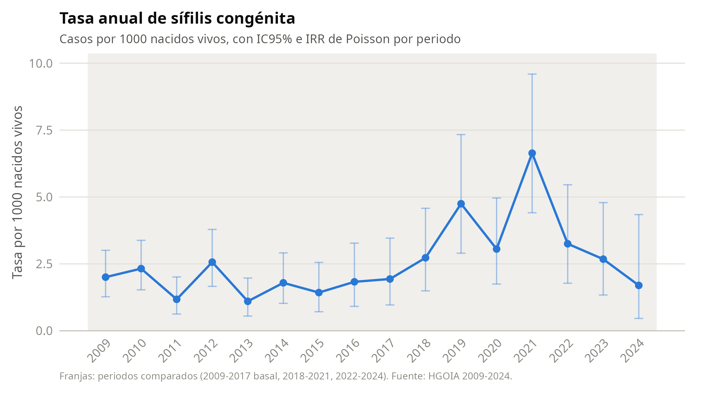
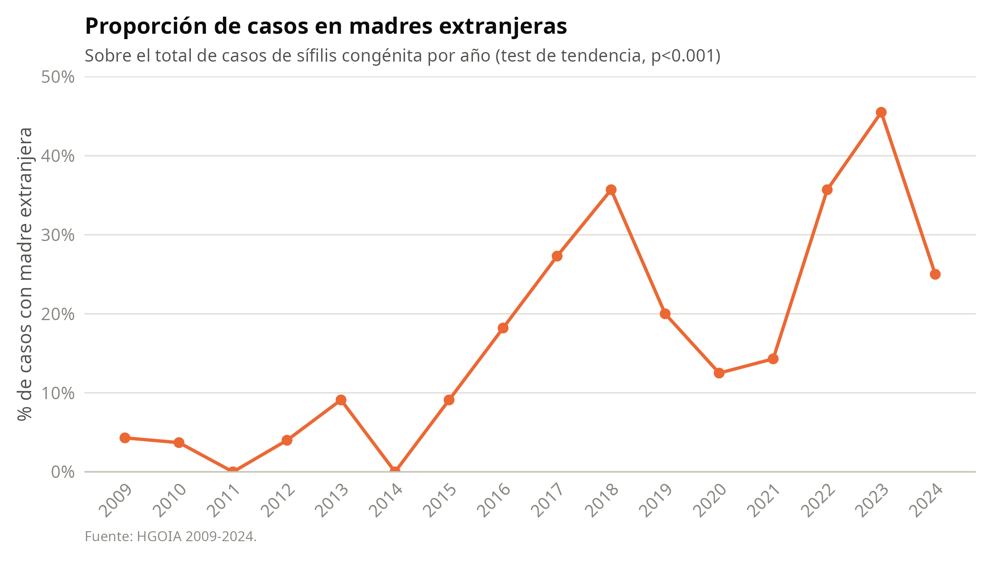
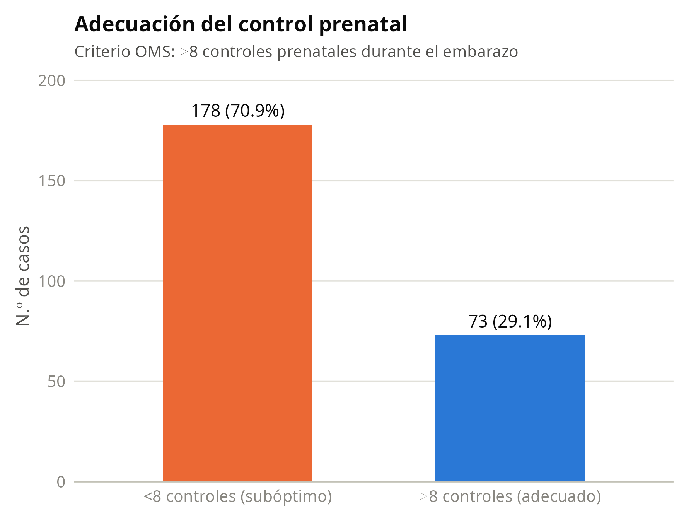
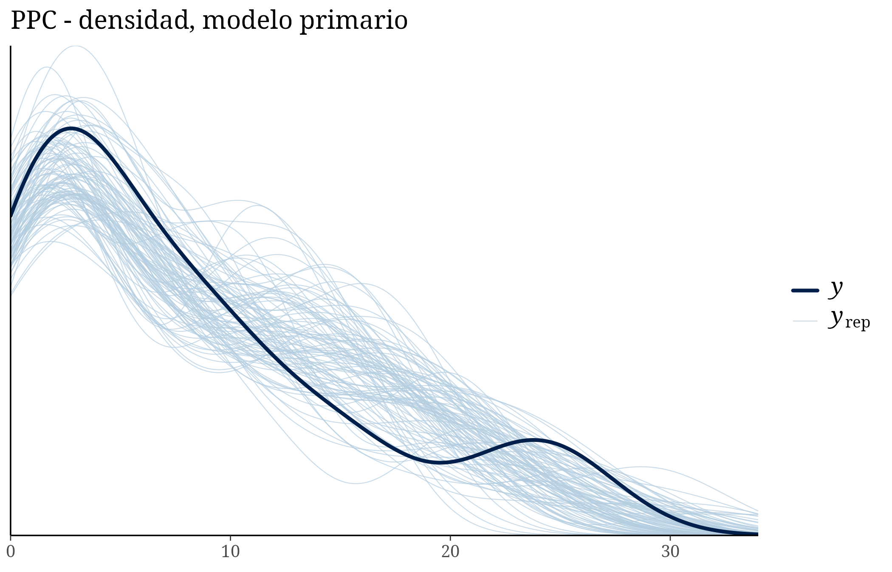
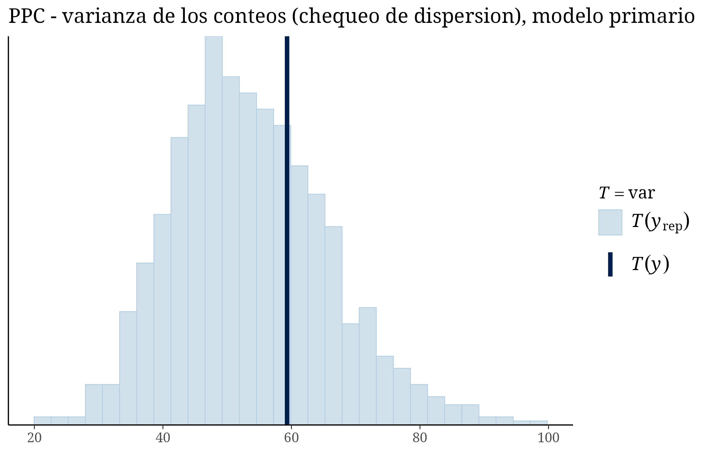

```{r setup, include=FALSE}
knitr::opts_chunk$set(echo = FALSE, warning = FALSE, message = FALSE)

suppressMessages({
  library(dplyr)
  library(readr)
  library(flextable)
  library(knitr)
})

set_flextable_defaults(font.size = 10, font.family = "Calibri",
                        border.color = "#c3c2b7", padding = 4)

tabla_word <- function(df, titulo = NULL) {
  ft <- flextable(df) %>%
    theme_booktabs() %>%
    bold(part = "header") %>%
    align(align = "left", part = "all") %>%
    autofit()
  if (!is.null(titulo)) ft <- set_caption(ft, titulo)
  ft
}

tasas          <- read_csv("output/tasas_anuales.csv", show_col_types = FALSE)
periodos       <- read_csv("output/comparacion_periodos.csv", show_col_types = FALSE)
extranjeras    <- read_csv("output/tendencia_extranjeras.csv", show_col_types = FALSE)
cpn            <- read_csv("output/adecuacion_cpn.csv", show_col_types = FALSE)
basal          <- read_csv("output/tabla_caracteristicas_basales.csv", show_col_types = FALSE)
test_tendencia <- readRDS("output/test_tendencia_extranjeras.rds")

casos_total_global       <- sum(tasas$casos_total)
nacimientos_total_global <- sum(tasas$nacimientos_total)
tasa_global               <- 1000 * casos_total_global / nacimientos_total_global
p_ic <- poisson.test(casos_total_global, nacimientos_total_global / 1000)

fmt1 <- function(x) formatC(x, format = "f", digits = 1)
fmt2 <- function(x) formatC(x, format = "f", digits = 2)
fmtp <- function(p) ifelse(p < 0.001, "<0.001", formatC(p, format = "f", digits = 3))

periodo_basal <- periodos %>% filter(periodo == "2009-2017")
periodo_2 <- periodos %>% filter(periodo == "2018-2021")
periodo_3 <- periodos %>% filter(periodo == "2022-2024")
```

# Introducción

La sífilis congénita continúa siendo un problema prevenible de salud pública y
un marcador de brechas en el tamizaje prenatal, el tratamiento materno oportuno
y el seguimiento perinatal. El objetivo de este análisis fue describir la
tendencia temporal de la sífilis congénita en un hospital de referencia de
Ecuador (HGOIA) entre 2009 y 2024, evaluar los cambios en la composición por
nacionalidad materna y caracterizar la adecuación del control prenatal.

# Métodos

## Diseño y población

Estudio retrospectivo descriptivo de todos los casos de sífilis congénita
diagnosticados en el HGOIA entre 2009 y 2024 (n = `r casos_total_global`
casos). El desenlace de inclusión (`BEBE.sifilis.congenita = 1`) es el criterio
diagnóstico de la cohorte, no una variable observada con variabilidad interna.

## Fuentes de datos y denominadores

Los numeradores (casos) provienen de la base individual de casos de sífilis
congénita del HGOIA (`SIFILIS_hgoia2009-2024.csv`, 255 registros, un caso por
fila). Los denominadores (nacidos vivos anuales, totales y por nacionalidad
materna) provienen de la base de partos por país de origen
(`Partos_pais_origen_2014-2025_HGOIA.csv`, formato ancho por país × año
2009-2024). Ambas bases fueron auditadas de forma cruzada y automatizada
(`R/01_auditoria_datos.R`): la suma de partos por país individual coincide
exactamente con la fila resumen "Total extranjeras" en los 16 años (diferencia
= 0), y no se detectaron inconsistencias internas. El total de nacidos vivos
del periodo 2009-2024 es
`r format(nacimientos_total_global, big.mark = ".", decimal.mark = ",")`
(detalle anual en la Tabla A1 del anexo); esta cifra, derivada directamente de
las bases vigentes, es la fuente única de denominadores para todo el
análisis.

## Definiciones operativas

A partir de la auditoría exhaustiva del diccionario de variables de la base de
casos (`R/02_diccionario_y_auditoria_variables.R`, 74 variables), se
identificaron pares de variables clínicamente relacionadas pero no idénticas.
Se fijaron las siguientes definiciones operativas para este análisis:

- **Trastorno hipertensivo del embarazo**: `TRASTORNOS.HIPERTENSIVOS.CATEGORIA`
  (diagnóstico categorizado del embarazo actual), en lugar de
  `Preclampsia.personal` (discordante en 36/253 casos, posible antecedente de
  embarazos previos).
- **Restricción de crecimiento fetal**: categoría "pequeño" de
  `PESO.EG.CATEGORIA` (clasificación peso/edad gestacional), en lugar del
  diagnóstico clínico `RCIU` (discordante en 5 casos).
- **Defecto congénito**: `Defectos.congenitos.CODIGO`, variable binaria
  (presente/ausente), en lugar de la desagregación por sistema afectado
  (`SISTEMA.AFECTADO`), que fragmenta los 21 casos positivos en categorías con
  n ≤ 7.

## Adecuación del control prenatal

Se clasificó la adecuación del control prenatal según la recomendación vigente
de la OMS: **subóptimo** si el número de consultas prenatales registradas fue
menor a 8, y **adecuado** si fue de 8 o más.

## Periodos de comparación

Se compararon tres periodos, definidos a priori según la evolución observada
del fenómeno: 2009-2017 (periodo basal), 2018-2021 y 2022-2024.

## Análisis estadístico

Las variables continuas se describen con mediana y rango intercuartílico
(RIC); las categóricas, con frecuencia absoluta y porcentaje. Las tasas
anuales y por periodo se expresaron por 1000 nacidos vivos, con intervalos de
confianza del 95% (IC95%) exactos de Poisson. La comparación entre periodos se
realizó mediante regresión de Poisson con offset del logaritmo de los nacidos
vivos, tomando 2009-2017 como categoría de referencia, y se reporta como razón
de tasas de incidencia (IRR) con IC95% y valor de p. La tendencia temporal de
la proporción de casos en madres extranjeras se evaluó con una prueba de
tendencia para proporciones (chi-cuadrado de tendencia lineal). Todos los
análisis se realizaron en R.

## Modelo bayesiano confirmatorio de tendencia por origen materno

Con el fin de cuantificar de forma probabilística la asociación entre el
origen materno (nacional vs. extranjera) y la incidencia de sífilis
congénita, y su evolución temporal, se ajustó un modelo bayesiano
confirmatorio sobre una tabla de 32 estratos (16 años × 2 orígenes
maternos; `R/06_modelo_bayesiano_primario.R`,
`output/estratos_anio_origen.csv`).

**Diagnóstico previo de la forma funcional.** Antes de fijar la
especificación del modelo primario se evaluó de forma exploratoria y
frecuentista la forma funcional del efecto del año
(`R/05_diagnostico_modelo_conteos.R`): un modelo con tendencia spline (3
grados de libertad) ajustó mejor que uno lineal (AIC 157,1 vs. 166,1;
razón de verosimilitud p = 0,002), y el estrato 2021-nacional resultó una
observación de alta influencia (distancia de Cook = 0,81, muy por encima
del umbral 4/n = 0,125; 24 casos sobre 3657 nacidos vivos). La dispersión
de Pearson (χ²/gl = 2,01) y un modelo binomial negativo exploratorio (θ =
10,2; AIC 160,3 vs. 167,4 del Poisson) sugirieron sobredispersión
leve-moderada. Pese a esta evidencia, y siguiendo la especificación
aprobada por el investigador principal el 10/08/2026, el modelo primario
se mantuvo con familia Poisson y tendencia **lineal** del año (sin
término cuadrático ni spline), reservando la binomial negativa como
contingencia no utilizada. El estrato influyente de 2021 no fue excluido:
se evaluó explícitamente mediante comprobación predictiva posterior (ver
Resultados).

**Modelo primario.** Se ajustó una regresión de Poisson bayesiana con
offset del logaritmo de los nacidos vivos:

$$\text{casos}_i \sim \text{Poisson}(\lambda_i), \quad
\log(\lambda_i) = \log(\text{nacimientos}_i) + \beta_0 + \beta_1\,\text{origen}_i + \beta_2\,\text{año\_c}_i + \beta_3\,(\text{origen}\times\text{año\_c})_i$$

donde año_c es el año centrado en la mediana del periodo. Los priors, en
la escala log(IRR), fueron: Intercepto ~ Normal(−6, 1); origen ~
Normal(0, 1); año_c ~ Normal(0, 0,5); interacción origen×año_c ~
Normal(0, 0,5) — priors débilmente informativos, consistentes con tasas
basales del orden de por mil y cambios anuales moderados. La estimación
se realizó con `brms`/Stan (backend `cmdstanr`), 4 cadenas de 4000
iteraciones (2000 de calentamiento), semilla 20260810, `adapt_delta` =
0,95 y `max_treedepth` = 12.

**Diagnósticos y convergencia.** Se exigió como criterio de aceptación:
R̂ < 1,01 en todos los parámetros, tamaño de muestra efectivo (ESS bulk y
tail) > 400, ausencia de transiciones divergentes y E-BFMI > 0,2.

**Comprobación predictiva posterior (PPC).** Se compararon las
densidades y la varianza observada vs. replicada, y se calculó
específicamente la probabilidad posterior predictiva de observar un
valor igual o mayor al del estrato 2021-nacional, el punto influyente
identificado en el diagnóstico previo.

**Análisis de sensibilidad.** Se reajustó el modelo primario con priors
más estrechos (desviación estándar × 0,5) y más amplios (× 2) para
evaluar la sensibilidad de las estimaciones a la elección de priors.
Como comparación adicional (no como criterio principal de
interpretación) se ajustó el modelo de Poisson frecuentista equivalente
(`glm`).

**Modelos secundarios.** Se exploró la asociación entre origen materno y
dos desenlaces clínicos mediante regresión logística bayesiana (familia
Bernoulli, función de enlace logit; prior Normal(0, 1,5) para el
intercepto y Normal(0, 1) para el coeficiente de origen), ajustada a
nivel de caso individual: control prenatal subóptimo (<8 consultas) y
pequeño para la edad gestacional (PEG). Estas comparaciones son **entre
casos** de sífilis congénita (no de incidencia poblacional).
Prematuridad, mortalidad, defecto congénito y preeclampsia **no se
modelaron** por número insuficiente de eventos en el brazo de madres
extranjeras (ver Tabla 7).

**Interpretación.** Los resultados bayesianos se reportan como razón de
tasas de incidencia (IRR) o razón de momios (OR) posteriores, con
mediana, intervalo de credibilidad del 95% (ICr95%) y probabilidad
posterior de que el efecto sea mayor (o menor) que 1, en lugar de
valores p.

\newpage

# Resultados

## Características generales de la cohorte

Se identificaron `r casos_total_global` casos de sífilis congénita entre
`r format(nacimientos_total_global, big.mark=".", decimal.mark=",")` nacidos
vivos en el periodo 2009-2024, para una tasa global de
`r fmt2(tasa_global)` por 1000 nacidos vivos (IC95%
`r fmt2(p_ic$conf.int[1])`–`r fmt2(p_ic$conf.int[2])`).

```{r tabla-basal}
tabla_word(basal %>% rename(Variable = variable, `n (%) / mediana [RIC]` = valor),
           "Tabla 1. Características de los 255 casos de sífilis congénita, HGOIA 2009-2024")
```

## Tendencia temporal de la tasa anual

```{r fig1, fig.cap="Figura 1. Tasa anual de sífilis congénita por 1000 nacidos vivos, HGOIA 2009-2024.", out.width="100%"}

```

La tasa anual alcanzó su máximo en 2021, con
`r tasas$casos_total[tasas$anio == 2021]` casos y
`r fmt2(tasas$tasa_x1000[tasas$anio == 2021])` por 1000 nacidos vivos.

```{r tabla-periodos}
periodos %>%
  transmute(
    Periodo = periodo,
    `Años` = anios,
    Casos = casos_total,
    `Nacidos vivos` = format(nacimientos_total, big.mark = ".", decimal.mark = ","),
    `Tasa x1000 (IC95%)` = sprintf("%s (%s-%s)", fmt2(tasa_x1000), fmt2(ic95_inf_tasa), fmt2(ic95_sup_tasa)),
    `IRR (IC95%)` = ifelse(is.na(irr), "1,00 (referencia)",
                            sprintf("%s (%s-%s)", fmt2(irr), fmt2(ic95_inf_irr), fmt2(ic95_sup_irr))),
    `Valor p` = ifelse(is.na(p_valor), "-", fmtp(p_valor))
  ) %>%
  tabla_word("Tabla 2. Comparación de la tasa de sífilis congénita por periodo (referencia: 2009-2017)")
```

En comparación con 2009-2017, el periodo 2018-2021 mostró un aumento
significativo de la tasa (IRR `r fmt2(periodo_2$irr)`; IC95%
`r fmt2(periodo_2$ic95_inf_irr)`-`r fmt2(periodo_2$ic95_sup_irr)`;
p`r fmtp(periodo_2$p_valor)`), mientras que 2022-2024 no difirió
significativamente del periodo basal (IRR `r fmt2(periodo_3$irr)`; IC95%
`r fmt2(periodo_3$ic95_inf_irr)`-`r fmt2(periodo_3$ic95_sup_irr)`;
p`r fmtp(periodo_3$p_valor)`).

## Cambios en la composición por nacionalidad materna

```{r fig2, fig.cap="Figura 2. Proporción de casos de sífilis congénita en madres extranjeras, HGOIA 2009-2024.", out.width="100%"}

```

La proporción de casos en hijos de madres extranjeras aumentó de
`r fmt1(extranjeras$pct_extranjeras[extranjeras$anio == 2009])`% en 2009 a un
máximo de `r fmt1(max(extranjeras$pct_extranjeras))`% en
`r extranjeras$anio[which.max(extranjeras$pct_extranjeras)]`
(prueba de tendencia, p`r fmtp(test_tendencia$p.value)`).

## Adecuación del control prenatal

```{r fig3, fig.cap="Figura 3. Adecuación del control prenatal (criterio OMS: ≥8 controles).", out.width="70%"}

```

```{r tabla-cpn}
cpn %>%
  mutate(adecuacion = ifelse(is.na(adecuacion), "Sin dato", adecuacion)) %>%
  rename(`Adecuación del control prenatal` = adecuacion, n = n, `%` = pct) %>%
  tabla_word("Tabla 3. Adecuación del control prenatal, HGOIA 2009-2024")
```

El `r fmt1((cpn %>% filter(adecuacion == "<8 controles (subóptimo)"))$pct)`%
de las gestantes tuvo un control prenatal subóptimo (<8 consultas).

## Modelo bayesiano: tendencia temporal y origen materno

```{r setup-bayes}
resumen_primario <- read_csv("output/bayes/resultados_modelo_primario.csv", show_col_types = FALSE) %>%
  rename(P_mayor1 = `P(IRR>1)`, P_menor1 = `P(IRR<1)`)
diag_primario <- read_csv("output/bayes/diagnosticos_modelo_primario.csv", show_col_types = FALSE)
sensibilidad  <- read_csv("output/bayes/sensibilidad_priors.csv", show_col_types = FALSE)
freq_equiv    <- read_csv("output/bayes/modelo_frecuentista_equivalente.csv", show_col_types = FALSE)
secundarios   <- read_csv("output/bayes/resultados_modelos_secundarios.csv", show_col_types = FALSE) %>%
  rename(P_mayor1 = `P(OR>1)`, P_menor1 = `P(OR<1)`)
eventos_sec   <- read_csv("output/eventos_outcomes_secundarios_por_origen.csv", show_col_types = FALSE)
ppc_checks    <- read_csv("output/bayes/ppc_checks_especificos.csv", show_col_types = FALSE)

irr_origen  <- resumen_primario %>% filter(parametro == "origen_IRR")
irr_anio    <- resumen_primario %>% filter(parametro == "anio_IRR")
irr_interac <- resumen_primario %>% filter(parametro == "interac_IRR")

fmtpct <- function(x) formatC(100 * x, format = "f", digits = 2)
```

El modelo primario alcanzó una convergencia adecuada: R̂ máximo
`r formatC(diag_primario$rhat_max, format="f", digits=4)`, ESS bulk
mínimo `r round(diag_primario$ess_bulk_min)`, ESS tail mínimo
`r round(diag_primario$ess_tail_min)`, `r diag_primario$divergencias`
transiciones divergentes y E-BFMI mínimo
`r formatC(diag_primario$ebfmi_min, format="f", digits=2)`; todos los
parámetros cumplieron los criterios de aceptación preespecificados.

```{r tabla-bayes-primario}
resumen_primario %>%
  transmute(
    Parámetro = recode(parametro,
                        origen_IRR = "Origen materno (extranjera vs. nacional)",
                        anio_IRR = "Tendencia anual",
                        interac_IRR = "Interacción origen × año"),
    `IRR posterior (mediana)` = fmt2(IRR_mediana),
    `ICr95%` = sprintf("%s-%s", fmt2(ICr95_inf), fmt2(ICr95_sup)),
    `P(IRR>1)` = paste0(fmtpct(P_mayor1), "%"),
    `P(IRR<1)` = paste0(fmtpct(P_menor1), "%")
  ) %>%
  tabla_word("Tabla 4. Modelo bayesiano primario: razones de tasas de incidencia (IRR) posteriores, 32 estratos año x origen materno")
```

La incidencia de sífilis congénita fue marcadamente mayor en hijos de
madres extranjeras que de madres nacionales (IRR
`r fmt2(irr_origen$IRR_mediana)`; ICr95%
`r fmt2(irr_origen$ICr95_inf)`-`r fmt2(irr_origen$ICr95_sup)`;
P(IRR>1) = `r fmtpct(irr_origen$P_mayor1)`%). Se observó además una
tendencia anual creciente de la incidencia global (IRR
`r fmt2(irr_anio$IRR_mediana)` por año; ICr95%
`r fmt2(irr_anio$ICr95_inf)`-`r fmt2(irr_anio$ICr95_sup)`;
P(IRR>1) = `r fmtpct(irr_anio$P_mayor1)`%). La interacción origen × año
no mostró evidencia concluyente de una diferencia en la pendiente
temporal entre ambos grupos (IRR `r fmt2(irr_interac$IRR_mediana)`;
ICr95% `r fmt2(irr_interac$ICr95_inf)`-`r fmt2(irr_interac$ICr95_sup)`,
intervalo que cruza 1; P(IRR>1) = `r fmtpct(irr_interac$P_mayor1)`%).

```{r fig-ppc1, fig.cap="Figura 4. Comprobación predictiva posterior (densidad), modelo primario.", out.width="90%"}

```

```{r fig-ppc2, fig.cap="Figura 5. Comprobación predictiva posterior de la varianza de los conteos, modelo primario.", out.width="90%"}

```

La comprobación predictiva posterior global no mostró evidencia de una
discrepancia sistemática entre los datos observados y los replicados por
el modelo (P(var(y_rep) ≥ var(y_obs)) =
`r fmt2(ppc_checks$probabilidad_posterior[ppc_checks$chequeo == "P(var(y_rep) >= var(y_obs))"])`,
sin indicios de sub- o sobre-dispersión no capturada). El estrato
influyente identificado en el diagnóstico previo (2021-nacional, 24
casos) sí fue, sin embargo, un valor extremo para el modelo primario: la
probabilidad posterior predictiva de observar un valor igual o mayor a
24 en ese estrato fue de solo
`r formatC(ppc_checks$probabilidad_posterior[ppc_checks$chequeo == "P(y_rep >= y_obs) 2021-nacional"], format="e", digits=1)`.
Esto es consistente con el diagnóstico frecuentista previo (evidencia de
no linealidad, distancia de Cook elevada) y constituye una limitación
del modelo primario lineal: el pico de 2021 está sub-representado por
una tendencia estrictamente lineal, aunque —según la especificación
aprobada por el investigador— no se modificó la forma funcional del
modelo confirmatorio.

```{r tabla-sensibilidad}
sensibilidad %>%
  transmute(
    Modelo = recode(modelo,
                     `priors_estrechos_(x0.5)` = "Priors estrechos (DE x 0,5)",
                     priors_aprobados = "Priors aprobados (primario)",
                     `priors_amplios_(x2)` = "Priors amplios (DE x 2)"),
    Parámetro = recode(parametro,
                        origen_IRR = "Origen materno",
                        anio_IRR = "Tendencia anual",
                        interac_IRR = "Interacción origen × año"),
    `IRR (mediana)` = fmt2(IRR_mediana),
    `ICr95%` = sprintf("%s-%s", fmt2(ICr95_inf), fmt2(ICr95_sup))
  ) %>%
  arrange(Parámetro, Modelo) %>%
  tabla_word("Tabla 5. Análisis de sensibilidad de priors: IRR posteriores bajo priors estrechos, aprobados y amplios")
```

Las estimaciones fueron estables frente a la elección de priors: el IRR
de origen materno varió entre
`r fmt2(min(sensibilidad$IRR_mediana[sensibilidad$parametro=="origen_IRR"]))`
y
`r fmt2(max(sensibilidad$IRR_mediana[sensibilidad$parametro=="origen_IRR"]))`
según el ancho de prior utilizado, sin cambios en la dirección ni en la
significancia práctica de ninguna de las tres estimaciones.

```{r tabla-freq-equiv}
freq_equiv %>%
  transmute(
    Parámetro = recode(parametro,
                        origenextranjera = "Origen materno (extranjera vs. nacional)",
                        anio_c = "Tendencia anual",
                        `origenextranjera:anio_c` = "Interacción origen × año"),
    `IRR (IC95%)` = sprintf("%s (%s-%s)", fmt2(IRR), fmt2(IC95_inf), fmt2(IC95_sup)),
    `Valor p` = fmtp(p_valor)
  ) %>%
  tabla_word("Tabla 6. Modelo de Poisson frecuentista equivalente (sensibilidad/comparación, no criterio principal de interpretación)")
```

El modelo de Poisson frecuentista equivalente arrojó estimaciones
puntuales prácticamente idénticas a las del modelo bayesiano primario,
lo que refuerza la robustez de los hallazgos frente a la elección de
marco de inferencia.

## Desenlaces secundarios según origen materno (comparación entre casos)

```{r tabla-eventos-secundarios}
eventos_sec %>%
  transmute(
    Desenlace = outcome,
    Origen = recode(Extrangera, si = "Extranjera", `no` = "Nacional"),
    n = n, Eventos = eventos, `%` = fmt1(pct)
  ) %>%
  tabla_word("Tabla 7. Frecuencia de desenlaces secundarios segun origen materno, entre los 255 casos de sifilis congenita")
```

Prematuridad, mortalidad, defecto congénito y preeclampsia no se
modelaron por número insuficiente de eventos en el brazo de madres
extranjeras (Tabla 7; p. ej., 0/36 fallecidos y 1/36 defectos congénitos
en ese grupo). Control prenatal subóptimo y PEG sí contaron con eventos
suficientes para un modelo bayesiano exploratorio:

```{r tabla-bayes-secundarios}
secundarios %>%
  transmute(
    Desenlace = recode(outcome,
                        CPN_subóptimo_extranjera_vs_nacional = "Control prenatal subóptimo (<8 consultas)",
                        PEG_extranjera_vs_nacional = "Pequeño para la edad gestacional (PEG)"),
    `OR (mediana)` = fmt2(OR_mediana),
    `ICr95%` = sprintf("%s-%s", fmt2(ICr95_inf), fmt2(ICr95_sup)),
    `P(OR>1)` = paste0(fmtpct(P_mayor1), "%")
  ) %>%
  tabla_word("Tabla 8. Modelos secundarios bayesianos (Bernoulli-logit): origen materno extranjero vs. nacional, entre casos de sifilis congenita")
```

Ninguna de las dos comparaciones entre casos fue concluyente: el control
prenatal subóptimo fue numéricamente más frecuente entre madres
extranjeras (OR
`r fmt2(secundarios$OR_mediana[secundarios$outcome=="CPN_subóptimo_extranjera_vs_nacional"])`),
pero el ICr95% incluyó 1
(`r fmt2(secundarios$ICr95_inf[secundarios$outcome=="CPN_subóptimo_extranjera_vs_nacional"])`-`r fmt2(secundarios$ICr95_sup[secundarios$outcome=="CPN_subóptimo_extranjera_vs_nacional"])`);
la proporción de PEG no difirió de forma relevante entre grupos (OR
`r fmt2(secundarios$OR_mediana[secundarios$outcome=="PEG_extranjera_vs_nacional"])`;
ICr95%
`r fmt2(secundarios$ICr95_inf[secundarios$outcome=="PEG_extranjera_vs_nacional"])`-`r fmt2(secundarios$ICr95_sup[secundarios$outcome=="PEG_extranjera_vs_nacional"])`).
Estos resultados deben interpretarse con cautela por el bajo número de
casos en el brazo de madres extranjeras (n = 36).

# Conclusiones preliminares

La sífilis congénita mostró un incremento temporal importante entre 2018 y
2021, con pico en 2021 y descenso posterior. Este patrón se acompañó de una
alta frecuencia de control prenatal subóptimo y de cambios en la composición
por nacionalidad materna, con una proporción creciente de casos en madres
extranjeras.

El modelo bayesiano confirmatorio corrobora estos hallazgos con un marco
probabilístico: el origen materno extranjero se asoció con una incidencia
de sífilis congénita más de dos veces mayor que el origen nacional (IRR
`r fmt2(irr_origen$IRR_mediana)`; ICr95%
`r fmt2(irr_origen$ICr95_inf)`-`r fmt2(irr_origen$ICr95_sup)`), y se
confirmó una tendencia anual creciente en la incidencia global, estable
frente al análisis de sensibilidad de priors y consistente con el modelo
frecuentista equivalente. No hay evidencia concluyente de que la
tendencia temporal difiera entre madres nacionales y extranjeras, ni de
diferencias entre casos en control prenatal subóptimo o en la proporción
de recién nacidos PEG según origen materno; estas últimas comparaciones
tienen poder limitado por el bajo número de casos en madres extranjeras.
El modelo primario, pese a su buen ajuste global, no captura plenamente
el pico observado en 2021 (estrato identificado como influyente en el
diagnóstico previo), lo cual debe considerarse al interpretar la
magnitud exacta de la tendencia temporal.

Estos hallazgos son preliminares y están sujetos a la interpretación
clínica del investigador principal.

\newpage

# Anexo. Tabla completa de tasas anuales

```{r tabla-anexo}
tasas %>%
  transmute(
    Año = as.character(anio), Casos = casos_total,
    `Nacidos vivos` = format(nacimientos_total, big.mark = ".", decimal.mark = ","),
    `Tasa x1000 (IC95%)` = sprintf("%s (%s-%s)", fmt2(tasa_x1000), fmt2(ic95_inf), fmt2(ic95_sup))
  ) %>%
  tabla_word("Tabla A1. Tasa anual de sífilis congénita por 1000 nacidos vivos, con IC95% exacto de Poisson")
```
