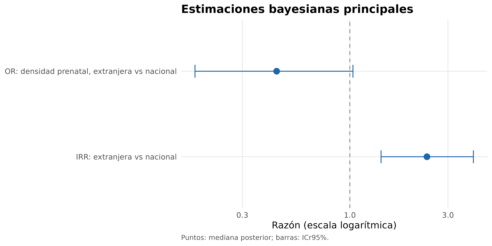
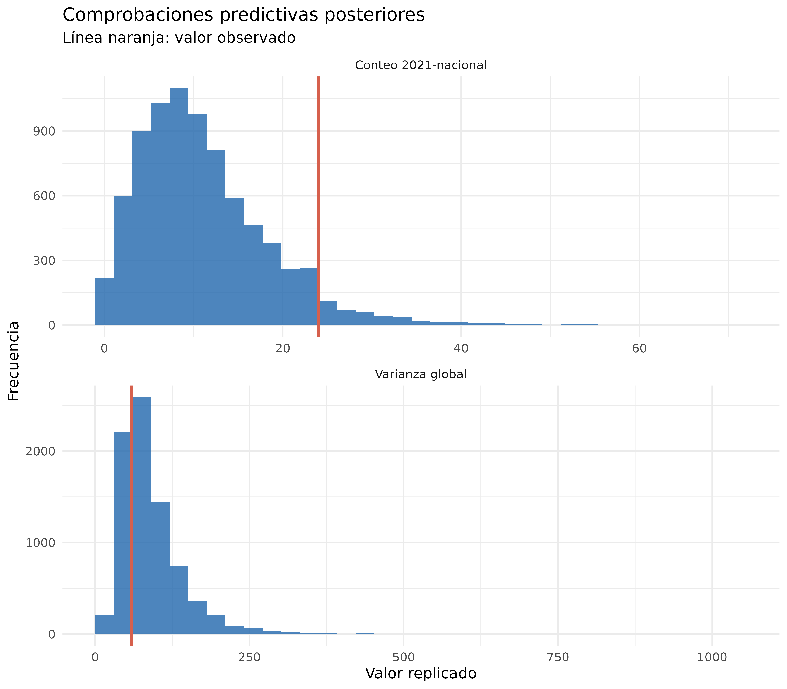
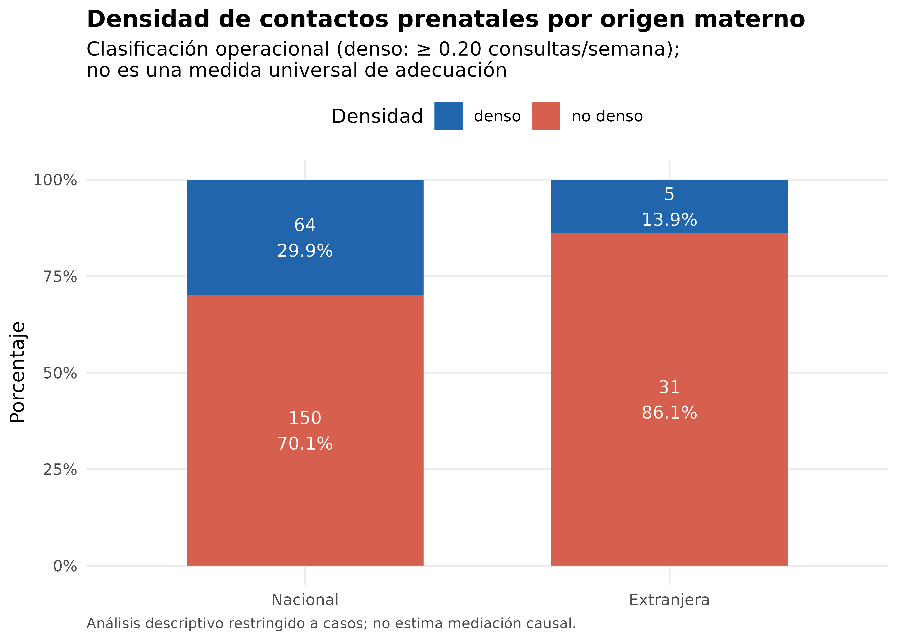

---
output:
  word_document:
    toc: false
    fig_caption: true
---

# Resultados

```{r setup, include=FALSE}
knitr::opts_chunk$set(echo=FALSE, warning=FALSE, message=FALSE, dpi=300)
library(readr); library(dplyr); library(flextable); library(knitr)
t1 <- read_csv("output/articulo/tabla1_caracteristicas_por_origen.csv", show_col_types=FALSE)
t2 <- read_csv("output/articulo/tabla2_tasas_anio_origen.csv", show_col_types=FALSE)
tm <- read_csv("output/articulo/tabla_modelo_principal.csv", show_col_types=FALSE)
t4 <- read_csv("output/articulo/tabla4_control_prenatal_por_origen.csv", show_col_types=FALSE)
t4b <- read_csv("output/articulo/tabla4b_modelo_control_prenatal.csv", show_col_types=FALSE)
freq <- read_csv("output/articulo/tabla_diagnosticos_frecuentistas.csv", show_col_types=FALSE)
mcmc <- read_csv("output/articulo/tabla_diagnosticos_mcmc.csv", show_col_types=FALSE)
ppc <- read_csv("output/articulo/tabla_ppc_summary.csv", show_col_types=FALSE)
loo <- read_csv("output/articulo/resumen_loo.csv", show_col_types=FALSE)
s21 <- read_csv("output/articulo/tabla_sensibilidad_2021.csv", show_col_types=FALSE)
s24 <- read_csv("output/articulo/tabla_sensibilidad_2024.csv", show_col_types=FALSE)
spr <- read_csv("output/articulo/tabla_sensibilidad_priors.csv", show_col_types=FALSE)
fmt <- function(x,d=2) formatC(x,format="f",digits=d,big.mark=".",decimal.mark=",")
val <- function(tab,key) tab$valor[match(key,tab[[1]])]
ft <- function(x,caption,note=NULL){
  z <- flextable(x) |> theme_booktabs() |> autofit() |> set_caption(caption)
  if(!is.null(note)) z <- add_footer_lines(z,note)
  z
}
irr <- tm |> filter(parametro=="IRR origen extranjera vs nacional")
shape <- tm |> filter(parametro=="Shape binomial negativa")
lrt <- freq |> filter(comparacion=="Lineal vs spline")
```

## Características de la población analizada

El análisis incluyó 255 casos de sífilis congénita y 111.742 nacimientos
registrados entre 2009 y 2024. Los datos se organizaron en 32 estratos,
correspondientes a 16 años y dos categorías de origen materno. De los 255 casos,
219 (85,9%) correspondieron a origen nacional y 36 (14,1%) a origen extranjero.
El origen materno estuvo disponible en los 255 casos y en todos los años
analizados.

## Características de los casos

La edad materna mediana fue de 26 años (RIC: 21–32). El número de consultas
prenatales estuvo disponible en 251 casos (98,4%): la mediana fue 6 (RIC: 4–8)
en el total, 6 (RIC: 4–8) entre los casos de origen nacional y 5 (RIC: 1–6)
entre los de origen extranjero. La edad gestacional estuvo disponible en 254
casos. Las características restantes se presentan en la Tabla 1.

```{r tabla1}
t1_show <- t1 |>
  rename(Característica=Caracteristica) |>
  mutate(across(-Característica, ~gsub("\\.", ",", .x)))
ft(t1_show,"Tabla 1. Características de los casos, en total y por origen materno.",
   "Las variables continuas se presentan como mediana [RIC]; las categóricas, como n (%). Los porcentajes usan los registros disponibles para cada variable.")
```

## Tasas observadas

La tasa global fue de `r fmt(1000*sum(t2$casos)/sum(t2$nacimientos),2)` casos por
1.000 nacimientos. La tasa total anual alcanzó su máximo en 2021, con 28 casos
entre 4.218 nacimientos (`r fmt(1000*28/4218,2)` por 1.000). La Tabla 2 presenta
los conteos, denominadores y tasas por año y origen materno.

```{r tabla2}
t2_show <- t2 |>
  transmute(Año=as.character(as.integer(anio)),
            Origen=recode(as.character(origen),nacional="Nacional",extranjera="Extranjera"),
            Casos=as.character(casos),
            Nacimientos=formatC(nacimientos,format="d",big.mark="."),
            `Tasa por 1.000`=fmt(tasa_1000,2))
ft(t2_show,"Tabla 2. Casos, nacimientos y tasas por año y origen materno.")
```

```{r figura1, fig.cap="Figura 1. Tasas observadas y predicciones posteriores por origen materno.", out.width="95%"}
include_graphics("figures/articulo/figura1_tasas_modelo_final.png")
```

## Diagnósticos exploratorios

El modelo Poisson con spline natural del año presentó un AIC de
`r fmt(lrt$AIC,1)` y mejoró el ajuste frente al modelo con año lineal
(LRT: χ²=`r fmt(lrt$LRT_chisq,3)`, `r lrt$LRT_df` grados de libertad;
p=`r format(lrt$p_value,digits=4)`). La dispersión de Pearson del modelo
Poisson con interacción fue `r fmt(freq$dispersion_pearson[freq$comparacion=="Lineal vs interacción"],2)`.
Cinco estratos superaron el umbral de Cook de 0,125: 2021-nacional (0,810),
2010-nacional (0,190), 2023-nacional (0,148), 2020-extranjera (0,136) y
2013-nacional (0,134).

## Modelo bayesiano principal

La IRR para origen materno extranjero frente a nacional fue
`r fmt(irr$estimador)` (ICr95%: `r fmt(irr$ICr95_inf)`–`r fmt(irr$ICr95_sup)`;
P[IRR>1]=`r fmt(irr$probabilidad_posterior,4)`). La mediana del parámetro
`shape` fue `r fmt(shape$estimador)` (ICr95%:
`r fmt(shape$ICr95_inf)`–`r fmt(shape$ICr95_sup)`).

```{r tabla3}
t3_show <- tibble(
  Parámetro=c("IRR: extranjera frente a nacional","Shape de la binomial negativa"),
  Estimación=c(fmt(irr$estimador,3),fmt(shape$estimador,3)),
  `ICr95%`=c(paste0(fmt(irr$ICr95_inf,3),"–",fmt(irr$ICr95_sup,3)),
             paste0(fmt(shape$ICr95_inf,3),"–",fmt(shape$ICr95_sup,3))),
  `Probabilidad posterior`=c(fmt(irr$probabilidad_posterior,4),"—")
)
ft(t3_show,"Tabla 3. Estimaciones del modelo bayesiano principal.")
```

```{r figura2, fig.cap="Figura 2. Estimaciones principales del modelo bayesiano.", out.width="90%"}

```

## Comprobaciones predictivas posteriores

El Rhat máximo fue `r fmt(val(mcmc,"Rhat máximo"),4)`, el ESS bulk mínimo fue
`r round(val(mcmc,"ESS bulk mínimo"))` y el ESS tail mínimo fue
`r round(val(mcmc,"ESS tail mínimo"))`. No se registraron divergencias ni
excedencias del límite de profundidad del árbol; el E-BFMI mínimo fue
`r fmt(val(mcmc,"E-BFMI mínimo"),3)`. La probabilidad de obtener una varianza
replicada al menos igual a la observada fue
`r fmt(val(ppc,"P(var yrep >= var yobs)"),4)`. En el estrato 2021-nacional se
observaron 24 casos; la mediana predictiva fue 10, con intervalo predictivo del
95% de 1 a 29 y P(Yrep≥24)=`r fmt(val(ppc,"P(yrep >= observado)"),4)`.

```{r figura3, fig.cap="Figura 3. Comprobaciones predictivas posteriores del modelo principal.", out.width="90%"}

```

## Validación cruzada LOO

El ELPD-LOO fue `r fmt(loo$ELPD_LOO,2)` (EE: `r fmt(loo$SE,2)`). El Pareto-k
máximo fue `r fmt(loo$pareto_k_max,3)`, correspondiente al estrato
`r loo$estrato_max`; ninguno de los 32 estratos presentó Pareto-k ≥0,7.

## Análisis secundario: densidad de control prenatal entre los casos

La densidad de control prenatal pudo calcularse en 250 de los 255 casos. Entre
ellos, 69 (27,6%) fueron clasificados como control prenatal denso y 181 (72,4%)
como no denso. Entre los 214 casos nacionales analizables, 64 (29,9%) fueron
clasificados como densos y 150 (70,1%) como no densos. Entre los 36 casos de
origen extranjero, 5 (13,9%) fueron clasificados como densos y 31 (86,1%) como
no densos.

La OR de presentar control prenatal denso para origen extranjero frente a
nacional fue `r fmt(t4b$OR_mediana,3)` (ICr95%:
`r fmt(t4b$OR_IC95_inf,3)`–`r fmt(t4b$OR_IC95_sup,3)`;
P[OR>1]=`r fmt(t4b$P_OR_gt_1,4)`). El Rhat máximo fue 1,0015, el ESS bulk mínimo
fue 4.837 y el ESS tail mínimo fue 4.620.

```{r tabla4}
t4_show <- t4 |>
  transmute(Origen=origen,
            Clasificación=recode(control_prenatal_densidad,adecuado="Denso",subóptimo="No denso"),
            n=as.character(n), Porcentaje=paste0(fmt(pct,1),"%"))
ft(t4_show,"Tabla 4. Densidad de control prenatal por origen materno entre los casos.")
```

```{r figura4, fig.cap="Figura 4. Densidad de control prenatal por origen materno entre los casos.", out.width="85%"}

```

## Análisis de sensibilidad

La estimación mantuvo su dirección al excluir ambos estratos de 2021
(IRR `r fmt(s21$IRR[2])`; ICr95%: `r fmt(s21$ICr95_inf[2])`–`r fmt(s21$ICr95_sup[2])`;
P[IRR>1]=`r fmt(s21$P_IRR_gt_1[2],4)`) y al excluir ambos estratos de 2024
(IRR `r fmt(s24$IRR[2])`; ICr95%: `r fmt(s24$ICr95_inf[2])`–`r fmt(s24$ICr95_sup[2])`;
P[IRR>1]=`r fmt(s24$P_IRR_gt_1[2],4)`). En los cinco escenarios de priors, las
medianas de la IRR variaron entre `r fmt(min(spr$IRR))` y
`r fmt(max(spr$IRR))`; todos registraron cero divergencias.

```{r tabla5}
t5 <- bind_rows(
  s21[2,] |> transmute(Análisis=modelo,IRR=fmt(IRR,3),
    `ICr95%`=paste0(fmt(ICr95_inf,3),"–",fmt(ICr95_sup,3)),`P(IRR>1)`=fmt(P_IRR_gt_1,4)),
  s24[2,] |> transmute(Análisis=modelo,IRR=fmt(IRR,3),
    `ICr95%`=paste0(fmt(ICr95_inf,3),"–",fmt(ICr95_sup,3)),`P(IRR>1)`=fmt(P_IRR_gt_1,4))
)
ft(t5,"Tabla 5. Análisis de sensibilidad por exclusión de años.")
```
